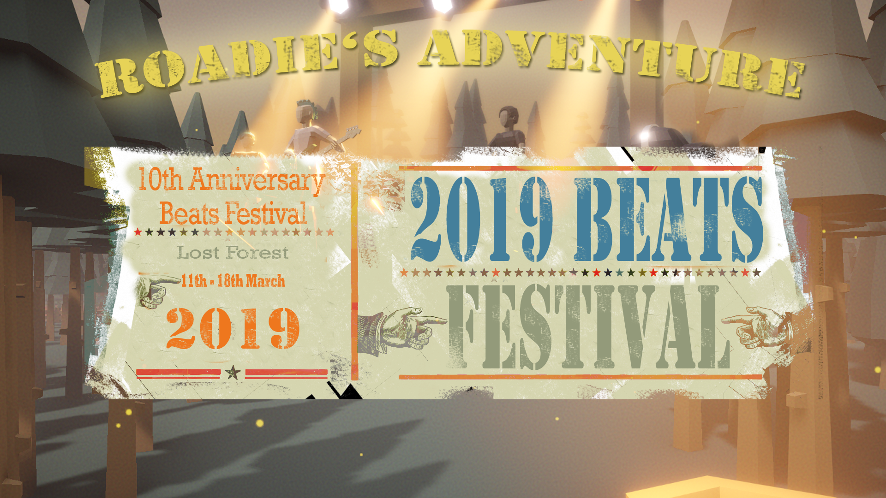
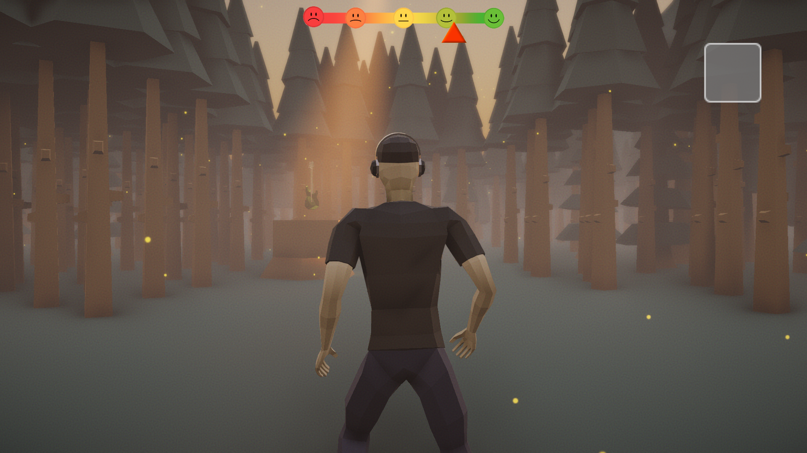
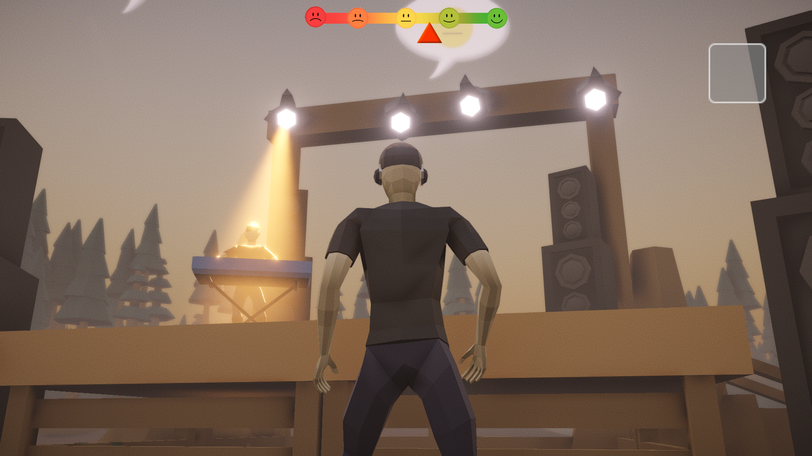
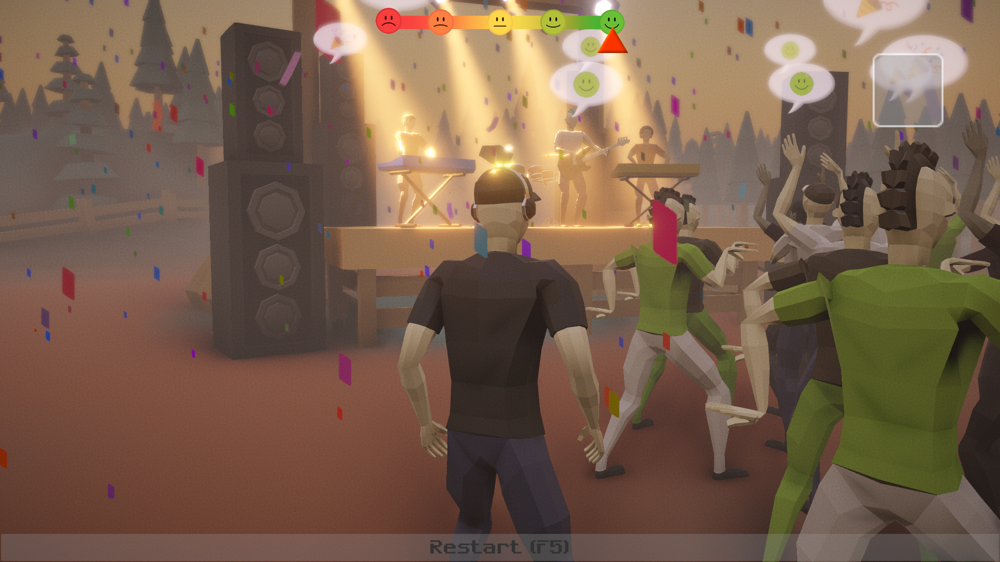

# Roadie's Adventure  
  
 
 
<table style="border: 0px solid black;">
    <tr align="center">
        <td>Discover your surroundings</td>
        <td>Return instruments to the stage</td>
        <td>Win the game</td>
    </tr>
    <tr align="center">
        <td></td>
        <td></td>
        <td></td>
    </tr>
</table>  
 

## Story  

"Welcome to our festival playground! I'm so happy you are finally here..."  
"We need your help!..."  
"We planned this amazing festival and invited all the people but suddenly the instruments went missing..."  
"Can you help us bring them back to the stage before the people getting to angry and throwing bombs at us?"  
"Thank you so much!"  

You are playing a roadie who is searching the missing instruments to get the festival started. There are four instruments hidden somewhere on the map. Find the instruments and bring them back to the stage before the crowd loses their good mood.  

## Controls  

<table>
    <tr>
        <th>move</th>
        <td>WASD + Mouse</td>
    </tr>
    <tr>
        <th>run</th>
        <td>shift</td>
    </tr>
    <tr>
        <th>jump</th>
        <td>space</td>
    </tr>
</table>

## Background  
This Project was created during a one week game jam in the first semester of the games master ("Time-based Media Games") of the Hamburg University of Applied Sciences. The topic of the game jame is "Drop Beats Not Bombs" and was implemented from a four member team. We used Unity with C#.  

You can see more information on: https://jhartmann.itch.io/rodies-adventure  
If you have questions or want to report a bug, please send an email to tobiasfox@gmx.net.